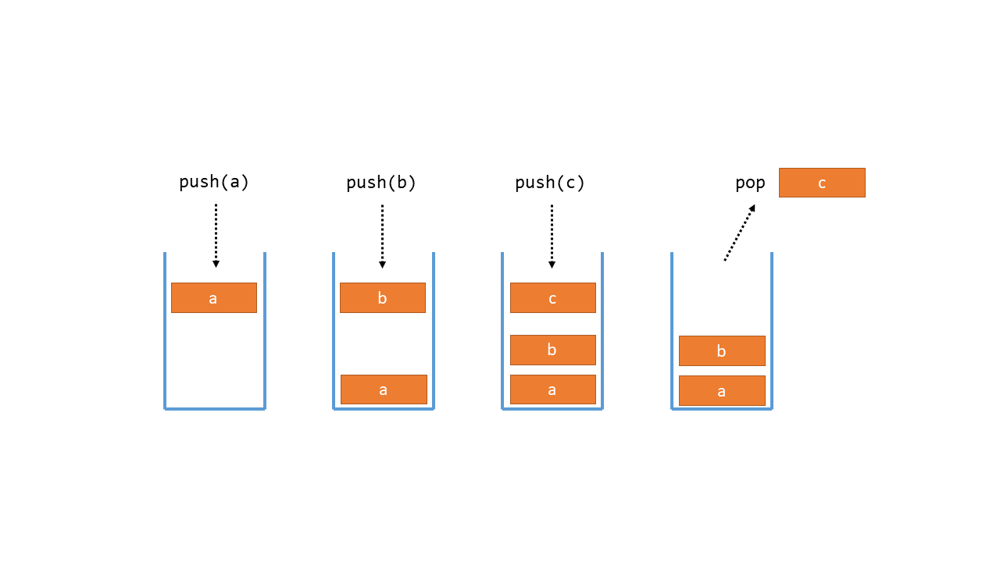

# COMP1110 Week 9 Lab

Before you start, you may wish to take a minute to watch the [intro video](https://comp.anu.edu.au/courses/comp1110/labs/mp4/lab9-intro.mp4) that runs through the goals of this lab.

This lab contains material from modules [**A1**](https://comp.anu.edu.au/courses/comp1110/lectures/theme/#A1) (Lists 1), [**A2**](https://comp.anu.edu.au/courses/comp1110/lectures/theme/#A2) (Lists 2), and [**C1**](https://comp.anu.edu.au/courses/comp1110/lectures/theme/#C1) (Recursion). The extension exercises contains material from  [**C4**](https://comp.anu.edu.au/courses/comp1110/lectures/theme/#C4) (Hash Functions) and [**C5**](https://comp.anu.edu.au/courses/comp1110/lectures/theme/#C4) (Hashing Applications).

**Tasks**
1. [ArrayStack](#ArrayStack.java) - [Stack Explanation](#stack)
2. [FamilyTree](#FamilyTree.java)

**Additional Exercises**
1. [Hashing](#1-hashing)
2. [Group Assignment](#2-work-on-your-group-assignment)

## Before the Lab 

* Complete Week 9 of your personal journal, commit and push at least 5 minutes prior to your lab.

## Purpose 

In this lab you will:
* implement the *Stack* abstract data type using an array as the underlying data structure;
* practise using recursion to solve a search problem; and
* become familiar with the format of exam questions used in this course.

**Your tutor will mark your engagement during the lab.**

## Part I: Check-In

Check in with **your tutor** together with the other members of your group.    Briefly outline any issues you're having that you'd particularly like help with during the lab (make sure you have your journal open and refer to it when you meet with your tutor).

## Part II:  Your Lab Tasks

You have two exercises this week: [ArrayStack](ArrayStack.java) and [FamilyTree](FamilyTree.java). Both of these exercises were final exam questions in Semester 1 2020 (like CropRotation from Lab 7), so they will be good practice leading up to your final exam. You should start with ArrayStack.

Unlike previous weeks, we have not created a step-by-step guide for solving these questions. The questions appear as they did in the final exam and all the information you need is self-contained within those Java files. While we aren't walking you through the problem, *your tutors are still more than happy to answer questions!* The purpose of these problems is to give you more practice with ADTs, recursion and the exam question format, and to build your confidence in solving programming problems.

### Stack

A *stack* is an abstract data type that allows elements to be added and removed in a last-in, first-out order.
A stack typically supports the following operations:
* push: adds an element to the top of the stack
* pop: removes and returns the element at the top of the stack
* peek: returns the element at the top of the stack, but does not remove it

Elements may only be added or removed at the top of the stack; any element underneath the topmost element cannot be removed without first removing the topmost element.

A stack may also support operations to query its size, or check whether an element is contained in the stack.
In this exercise you will implement a stack using an array data structure to store the elements.

## Part III: Additional Exercises

Remember that these are additional exercises for your own practice. They are not compulsory, but your tutor will be happy to provide assistance and feedback during the lab.

### 1. Hashing

**Create a hash program**

Using the lecture code from C05 as a template:

* Read the data from `assets/us_postal_codes.txt`. Each line contains a postal code,town name, state name, state code,county name, latitude and longitude.

Then:
Imagine you are in charge of the entire US postal service, and you have only 50 delivery officers to cover the entire country (40933 zip codes).
You want to give each person a roughly equal amount of work (imagine each post code has the same amount of mail).

Create a hash function that will:
1. Split the work as evenly as possible (imagine that each post code has the same amount of mail)
2. Minimise the travel each person does as much as possible. Imagine that each person starts at any one of their zip codes, and avoid them having to travel across the country.

You can test 1. by running the program and checking the histogram of results to see if the hash function is even.

How many ways can you do this?

### 2. Work on your group assignment

Use any spare time to work on your group assignment.
